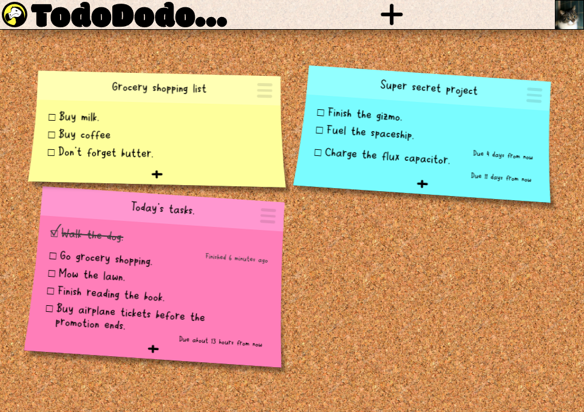

 

**TodoDodo** is an easy-to-use, responsive and colorful web app built with NodeJS that helps you stay organized and achieve your goals. With TodoDodo, you can easily create sticky notes to keep track of tasks and due dates, share them with other users, check them off when they're done, and delete them when they're no longer needed. TodoDodo is self-contained, so you don't need any external applications or services to get started - just start adding notes and get organized!
  

## Features

You can add notes to your wall and customize their name and color.
Notes can be shared with other users, they will be able to see and edit your note.
Notes support unlimited amount of tasks that you can add to them.
You can set due date on tasks to see how much time you have left.
When you check tasks, the app keeps track of who and when someone completed them.

## Installation and running

- Install NPM https://nodejs.org/en/download/.
- Open command line in project folder.
- Clone this repository with command. `git clone https://git.internal.st/internal/todododo`
- Type: `npm install`
- Type: `npm start`

### Configuration

- Create environment variable called `TODODODO_PORT` and set it to port that you want the app to listen on.
- Create environment variable called `TODODODO_SECRET` and set it to long and random string. It will be used as seed to hash user passwords.

## Contributing

Project is open to contributions by anyone. Feel free to create a pull request for any fixes or changes.

## License

 This work is licensed under a <a rel="license" href="http://creativecommons.org/licenses/by-sa/4.0/">Creative Commons Attribution-ShareAlike 4.0 International License</a>.
